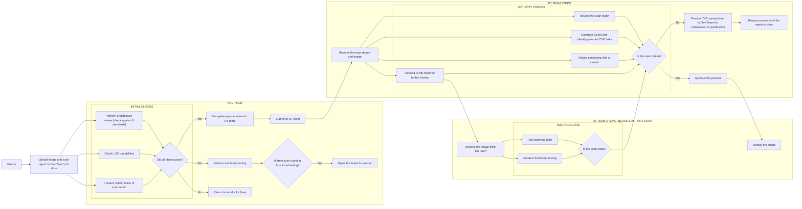
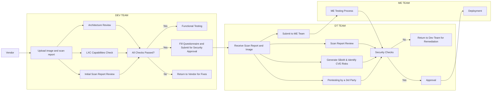
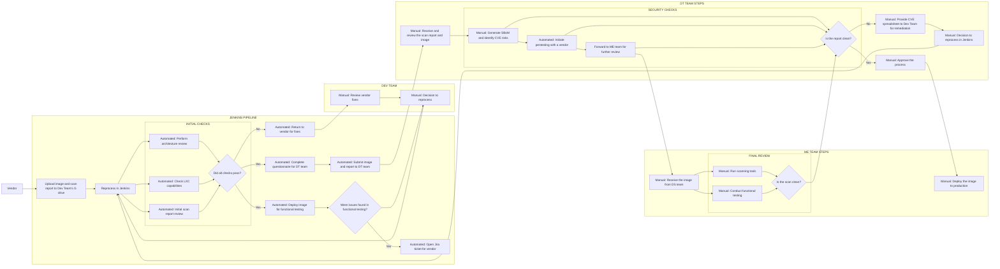

Process Description
1. Vendor's Role
* The process begins with the Vendor uploading an image and a scan report to the Dev Team's designated G drive. This initiates the workflow, providing the necessary materials for further evaluation and testing by the Dev Team.
2. Dev Team's Responsibilities
* Initial Checks:
    * The Dev Team performs several checks to ensure the image meets the required standards.
    * Architecture Review: They assess the architecture to confirm that it aligns with the X standards.
    * LXC Capabilities Check: The team verifies whether the image is compatible with LXC (Linux Containers), ensuring that it can run properly in the targeted environment.
    * Initial Scan Report Review: The scan report is reviewed for any immediate issues or security vulnerabilities.
* Decision Point - Did All Checks Pass?:
    * If all initial checks are successful, the Dev Team proceeds to the next steps.
    * If any check fails, the image and report are returned to the vendor for corrections.
* Functional Testing:
    * The Dev Team conducts functional testing to ensure the image performs as expected in the intended environment.
    * Handling Issues: If issues are discovered during functional testing, a Jira ticket is opened to notify the vendor, who must address these issues.
* Questionnaire Completion:
    * Concurrently, the Dev Team completes a detailed questionnaire for the DT Team, which contains critical information about the image and its initial review.
* Handing Over to DT Team:
    * After completing the questionnaire and functional testing, the Dev Team submits the image and scan report to the DT Team for further analysis.
3. DT Team's Responsibilities
* Receiving the Report and Image:
    * The DT Team receives the image and scan report from the Dev Team.
* Security Analysis:
    * The DT Team undertakes a comprehensive review of the scan report.
    * SBoM Generation & CVE Identification: They generate a Software Bill of Materials (SBoM), listing all software components and identifying potential Common Vulnerabilities and Exposures (CVE) risks.
    * Pentesting: The DT Team initiates penetration testing with an external vendor to uncover any security vulnerabilities.
    * Forward to ME Team: The findings and image are then forwarded to the ME Team for additional scrutiny.
* Security Checks - Is the Report Clean?:
    * All security checks, including the scan report review, SBoM analysis, and pentesting results, are compiled to determine if the image is clean.
    * If Issues Are Found: If the report is not clean, the DT Team provides a CVE spreadsheet to the Dev Team, requiring remediation or justification. The process is repeated until the report is clean.
    * If Clean: If no issues are found, the image is approved and sent for deployment.
4. ME Team's Responsibilities
* Receiving the Image:
    * The ME Team receives the image from the DT Team.
* Scanning and Testing:
    * Run Scanning Tools: The ME Team runs various scanning tools to further assess the image for any overlooked vulnerabilities.
    * Conduct Functional Testing: The ME Team also performs functional testing to validate the image’s operation within the target environment.
* Decision Point - Is the Scan Clean?:
    * The results of the scanning and testing are analyzed to ensure the image is clean.
    * If Clean: If the image passes all tests, the process is approved and moves to deployment.
    * If Not Clean: If issues are found, the process loops back to the DT Team for further remediation.
5. Final Deployment
* Once all teams (Dev, DT, and ME) have confirmed that the image is clean and meets the required standards, it is approved for deployment, marking the end of the process.

Potential Automations in the Jenkins Pipeline
1. Automated Image Upload and Initial Scanning
    * Triggering the Pipeline:
        * The pipeline can be triggered automatically when the vendor uploads an image and scan report to a specified location (e.g., a G drive, S3 bucket, or any other storage).
    * Automated Upload and Scan:
        * Jenkins can automatically retrieve the uploaded image and initiate a scan using integrated security tools (e.g., Clair, Trivy, or other container/image scanning tools).
        * Automation Steps:
            * Fetch the image from the upload location.
            * Run the initial scan and store the report in a versioned repository or attach it to the build artifacts.
2. Automated Architecture Review and LXC Capabilities Check
    * Automated Checks:
        * Jenkins can be configured to automatically run scripts or tools that check the architecture against predefined X standards and verify LXC capabilities.
        * Automation Steps:
            * Use a script or tool that checks the architecture against standards (could be a static analysis tool or a custom script).
            * Verify LXC capabilities using a testing framework or custom checks.
3. Automated Functional Testing
    * Deploying the Image for Testing:
        * The pipeline can automate the deployment of the image onto a testing device or environment. Tools like Ansible, Terraform, or Kubernetes can be used to orchestrate this.
        * Automation Steps:
            * Deploy the image to a test environment (e.g., virtual machines, containers, or physical devices).
            * Execute functional tests automatically using testing frameworks like Robot Framework, Selenium, or custom scripts.
            * Capture test results and feed them back into Jenkins.
    * Handling Issues:
        * If functional testing fails, Jenkins can automatically create a Jira ticket, assign it to the appropriate team, and attach the relevant logs and reports.
        * Automation Steps:
            * Integrate Jenkins with Jira using plugins to automatically create and manage tickets.
            * Attach test logs, reports, and any relevant data to the Jira ticket.
4. Automated SBoM Generation and CVE Identification
    * Security Analysis Automation:
        * Jenkins can automate the generation of a Software Bill of Materials (SBoM) and scan it for known vulnerabilities (CVE risks) using tools like OWASP Dependency-Check, Syft, or Grype.
        * Automation Steps:
            * Generate SBoM using tools like Syft.
            * Scan the SBoM for CVEs and produce a report.
            * Automatically notify relevant teams if critical vulnerabilities are found.
5. Pentesting Automation
    * Automated Pentesting Initiation:
        * While full pentesting is often manual, certain aspects can be automated, such as initiating pentesting tools (e.g., OpenVAS, Nessus) and collecting results.
        * Automation Steps:
            * Run automated penetration tests using pre-configured tools.
            * Collect and store results for further analysis.
            * Trigger manual steps if severe issues are found.
6. Filling and Submitting Questionnaires
    * Automated Questionnaire Generation:
        * If the questionnaire is based on predefined data (e.g., scan results, test results), Jenkins can automatically generate and fill out the questionnaire based on this data.
        * Automation Steps:
            * Use templates and scripts to populate questionnaires with data from the scans and tests.
            * Automatically submit the questionnaire to the DT team, possibly by email or integrating with a collaboration tool like Confluence or Jira.
7. Final Scanning and Approval
    * Automated Final Scanning:
        * The ME Team's final scanning can be automated similarly to the initial scan, with Jenkins triggering the appropriate tools.
        * Automation Steps:
            * Re-run scans using the same or different tools to ensure no new vulnerabilities have been introduced.
            * Collect the final reports and prepare them for approval.
8. Automated Deployment
    * Automatic Deployment:
        * Once the image is approved, Jenkins can automate the deployment to production or other environments.
        * Automation Steps:
            * Deploy the image using tools like Kubernetes, Docker, or a continuous deployment tool.
            * Verify the deployment and send notifications upon successful completion.
How to Implement This Automation in Jenkins
* Jenkins Pipelines:
    * Use Jenkins pipelines to define the steps in the process. Each stage in the pipeline corresponds to a different phase of the process (e.g., scanning, testing, review).
    * Example Pipeline Stages:
        * stage('Fetch Image & Scan') – Automates image retrieval and scanning.
        * stage('Architecture Review & LXC Check') – Automates architecture and capabilities checks.
        * stage('Functional Testing') – Deploys the image and runs functional tests.
        * stage('Generate SBoM & CVE Scan') – Automates SBoM generation and vulnerability scanning.
        * stage('Pentesting') – Initiates automated pentesting.
        * stage('Questionnaire & Submission') – Automates filling out and submitting questionnaires.
        * stage('Final Approval & Deployment') – Handles final approval and deployment.
* Integrations:
    * Security Tools: Integrate Jenkins with security tools for scanning (e.g., Clair, Trivy, OWASP Dependency-Check).
    * Test Automation: Integrate with testing frameworks and environments (e.g., Selenium, Robot Framework).
    * Issue Tracking: Integrate Jenkins with Jira for automatic issue creation and tracking.
    * Notification Systems: Use email, Slack, or other tools to notify teams at different stages of the pipeline.

