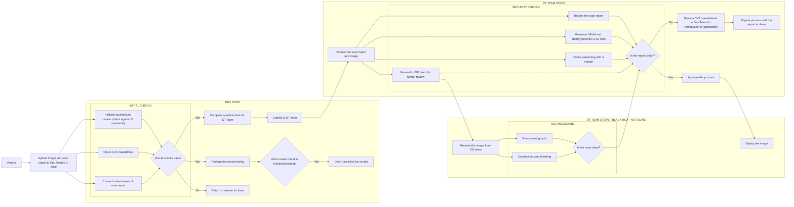

```mermaid
graph LR
  A[Vendor]
  A --> B["Upload image and scan report to Dev Team's G drive"]
  
  B --> C["Perform architecture review (check against X standards)"]
  B --> D["Check LXC capabilities"]
  B --> E["Conduct initial review of scan report"]

  subgraph DEV TEAM
    subgraph INITIAL CHECKS
        C --> F
        D --> F
        E --> F
        F{"Did all checks pass?"}
    end

    F -->|Yes| G["Complete questionnaire for DT team"]
    F -->|Yes| H["Perform functional testing"]
    F -->|No| I["Return to vendor for fixes"]

    G --> J["Submit to DT team"]
    H --> K{"Were issues found in functional testing?"}
    K -->|Yes| L["Open Jira ticket for vendor"]
  end
  
  subgraph DT TEAM STEPS
    J --> M["Receive the scan report and image"]
    M --> N["Review the scan report"]
    M --> O["Generate SBoM and identify potential CVE risks"]
    M --> P["Initiate pentesting with a vendor"]
    M --> Q["Forward to ME team for further review"]

    subgraph SECURITY CHECKS
        N --> R
        O --> R
        P --> R
        Q --> R
        R{"Is the report clean?"}
    end

    R -->|No| S["Provide CVE spreadsheet to Dev Team for remediation or justification"]
    R -->|Yes| T["Approve the process"]
    S --> U["Repeat process until the report is clean"]
  end

  subgraph DT TEAM STEPS - BLACK BOX - NOT SURE
    Q --> V["Receive the image from DS team"]
    V --> W["Run scanning tools"]
    V --> X["Conduct functional testing"]

    subgraph TESTING/SCANS
        W --> Y
        X --> Y
        Y{"Is the scan clean?"}
    end

    Y --> R
    T --> Z["Deploy the image"]
  end
```
