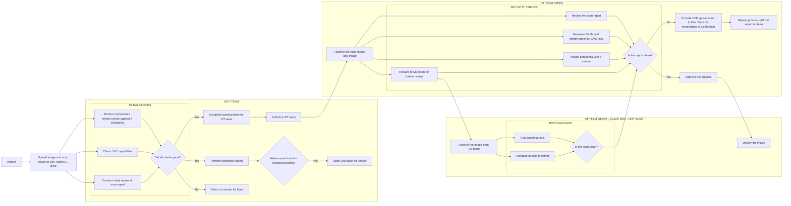
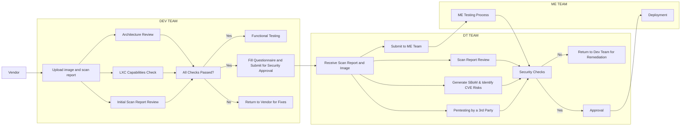

Process Description
1. Vendor's Role
* The process begins with the Vendor uploading an image and a scan report to the Dev Team's designated G drive. This initiates the workflow, providing the necessary materials for further evaluation and testing by the Dev Team.
2. Dev Team's Responsibilities
* Initial Checks:
    * The Dev Team performs several checks to ensure the image meets the required standards.
    * Architecture Review: They assess the architecture to confirm that it aligns with the X standards.
    * LXC Capabilities Check: The team verifies whether the image is compatible with LXC (Linux Containers), ensuring that it can run properly in the targeted environment.
    * Initial Scan Report Review: The scan report is reviewed for any immediate issues or security vulnerabilities.
* Decision Point - Did All Checks Pass?:
    * If all initial checks are successful, the Dev Team proceeds to the next steps.
    * If any check fails, the image and report are returned to the vendor for corrections.
* Functional Testing:
    * The Dev Team conducts functional testing to ensure the image performs as expected in the intended environment.
    * Handling Issues: If issues are discovered during functional testing, a Jira ticket is opened to notify the vendor, who must address these issues.
* Questionnaire Completion:
    * Concurrently, the Dev Team completes a detailed questionnaire for the DT Team, which contains critical information about the image and its initial review.
* Handing Over to DT Team:
    * After completing the questionnaire and functional testing, the Dev Team submits the image and scan report to the DT Team for further analysis.
3. DT Team's Responsibilities
* Receiving the Report and Image:
    * The DT Team receives the image and scan report from the Dev Team.
* Security Analysis:
    * The DT Team undertakes a comprehensive review of the scan report.
    * SBoM Generation & CVE Identification: They generate a Software Bill of Materials (SBoM), listing all software components and identifying potential Common Vulnerabilities and Exposures (CVE) risks.
    * Pentesting: The DT Team initiates penetration testing with an external vendor to uncover any security vulnerabilities.
    * Forward to ME Team: The findings and image are then forwarded to the ME Team for additional scrutiny.
* Security Checks - Is the Report Clean?:
    * All security checks, including the scan report review, SBoM analysis, and pentesting results, are compiled to determine if the image is clean.
    * If Issues Are Found: If the report is not clean, the DT Team provides a CVE spreadsheet to the Dev Team, requiring remediation or justification. The process is repeated until the report is clean.
    * If Clean: If no issues are found, the image is approved and sent for deployment.
4. ME Team's Responsibilities
* Receiving the Image:
    * The ME Team receives the image from the DT Team.
* Scanning and Testing:
    * Run Scanning Tools: The ME Team runs various scanning tools to further assess the image for any overlooked vulnerabilities.
    * Conduct Functional Testing: The ME Team also performs functional testing to validate the image’s operation within the target environment.
* Decision Point - Is the Scan Clean?:
    * The results of the scanning and testing are analyzed to ensure the image is clean.
    * If Clean: If the image passes all tests, the process is approved and moves to deployment.
    * If Not Clean: If issues are found, the process loops back to the DT Team for further remediation.
5. Final Deployment
* Once all teams (Dev, DT, and ME) have confirmed that the image is clean and meets the required standards, it is approved for deployment, marking the end of the process.

